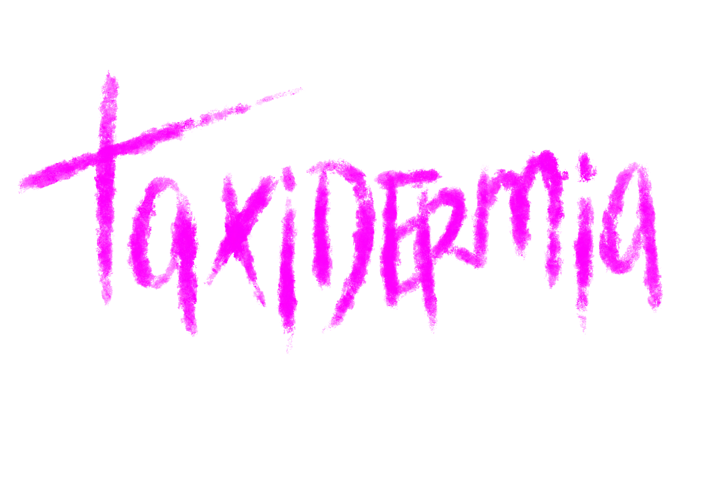
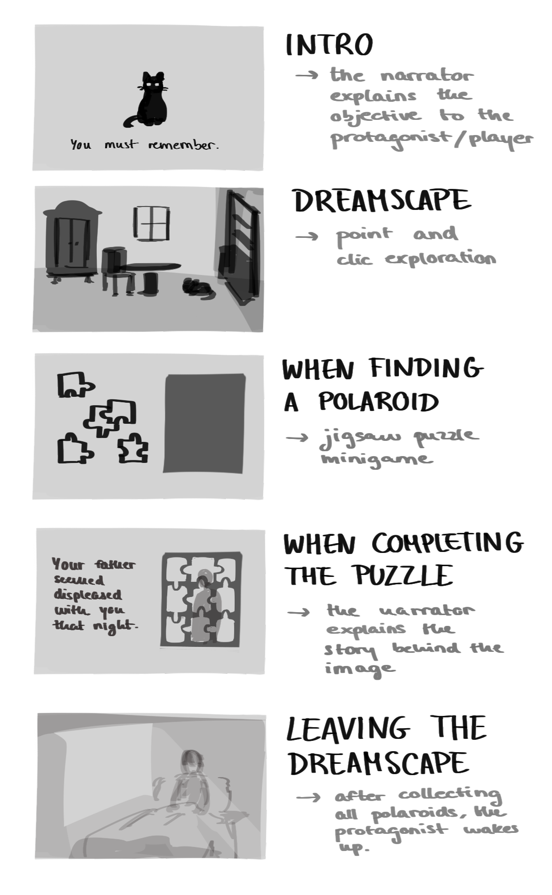
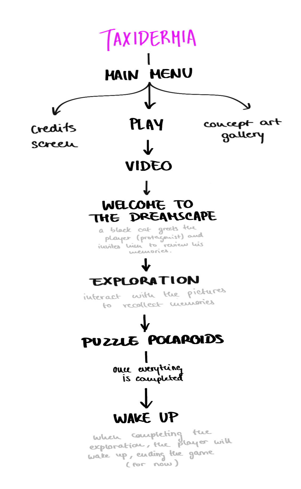

## TAXIDERMIA

Proyecto de Creación Multimedia Interactiva de la  Facultad de Bellas Artes de la Univesidad de Granada

# 1 Datos 

**Titulo** : Taxidermia

**Web:**   https://zyedin.itch.io/taxidermia

**Autor:**  Logan Porcel Hidalgo

 [Profile Card](cmi-card.html)  [Alternate Profile Card](cmi-card2.html)

**Resumen** : Se trata de una pequeña novela visual de misterio donde exploramos los sueños del protagonista, un joven detective que trabaja bajo el equipo de investigación de su padre adoptivo. Mediante se desvelan fragmentos sobre el pasado del protagonista, también se desbloquearán pistas necesarias para resolver un crimen a mayor escala que el grupo se encuentra investigando. El juego está en inglés por comodidad propia.

**Estilo/género:**  Novela visual / Point-n-click / Puzzles

**Logotipo** : 

**Resolución:** 1152x648px

**Probado en:** Navegador

**Tamaño proyecto:** 98,5 MB 

**Licencia:** Este proyecto tiene una Licencia CC Reconocimiento Compartir igual (CC BY-SA)

**Fecha** : 28/05/2026

**Medios**:

- Github: https://github.com/browmbie/taxidermia
- Twitter: https://x.com/zyedin_
- Itch.io: https://zyedin.itch.io/taxidermia

# 2. Memoria del proyecto 

### 2.1 Storyboard (EN): 

"Wooyoung has always had trouble remembering things. Ever since Mr. Kurosawa took him in, he's been documenting his everyday life by taking pictures of his most important memories. But it wasn't always like this. Every night, Wooyoung must explore his dreamscape in order to pick up pieces of his fragmented mind so he can function as a normal human being would, and figure out the greater mystery behind his past."

This demo of the game focuses only on the first dream exploration segment. The visual novel aspect where you get to play during the daytime is planned to be implemented later on if possible.

### 2.2. Esquema de navegación (EN)

# 3. Metodología

## Etapa 1: Ideación de proyecto

**Investigación de campo** 

El proyecto está basado en muchas novelas visuales y juegos de terror y misterio que he jugado a lo largo de mi vida. Las inspiraciones más inmmediatas que se me vienen a la cabeza, ya sean por gameplay o estética, son:

- [Your Turn To Die](https://store.steampowered.com/app/2067780/Your_Turn_To_Die_Death_Game_By_Majority/?l=spanish) Una novela visual con elementos point-n-click de misterio, basada en la saga de videojuegos de Danganronpa y otrosjuegos de muerte.
- [Yumme Nikki](https://store.steampowered.com/app/650700/Yume_Nikki/?l=spanish). Un walking simulator de terror donde se exploran los sueños de la protagonista. A su vez, toma referencia de [LSD Dream Emulator](https://store.steampowered.com/app/3299190/LSD_Dream_Emulator_Retro/?l=spanish). Otro juego de corriente parecida sería [Omori](https://store.steampowered.com/app/1150690/OMORI/?l=spanish), que se centra más en contar una historia mediante alternamos entre el día a día y los sueños del protagonista.
- En cuanto a estética, como música y diseño medioambiental, [Lost in Vivo](https://store.steampowered.com/app/963710/Lost_in_Vivo/?l=spanish) y la saga entera de [Silent Hill](https://es.wikipedia.org/wiki/Silent_Hill_(franquicia)) siempre están presentes en mi cabeza a la hora de crear. También el género del [terror análogico](https://es.wikipedia.org/wiki/Terror_anal%C3%B3gico) y los [espacios liminales](https://es.wikipedia.org/wiki/Liminalidad).

**Motivación de la propuesta** 

Quise hacer este juego porque está basado en una historia que llevo escribiendo varios años. Ya que se trata de un proyecto pequeño, me he basado en un pequeño fragmento del pasado del protagonista. Mi motivación principal es tantear el terreno de la programación de videojuegos, para así en un futuro desarrollar esta historia al completo y a mi gusto. Además, me serviría de prueba para ver qué mecánicas podría implementar en ese futuro proyecto.

**Publico / audiencia**

Mayores de 18 años. Aunque este juego es algo personal, así que está más bien orientado a un público cercano a mi, pero cualquiera podría interesarse por la historia.

## Etapa 2: Desarrollo / actividades realizadas

(qué soluciones has planteado y cómo se han resuelto: juego, galería de fotos, grabación de video, etc.)

- Menú principal:
  Las animaciones del menú las hice con un script que alternara entre dos imagenes constantemente (tiempo dado por un Timer). El resto de animaciones están programadas con un Animation Player (aparición de los botones, título, fade-in inicial...). Los submenús (créditos y galería) también cuentan con un AnimationPlayer de fade-in.
- La galería carga un Sprite2D donde se exportan varias imágenes mediante "imglist". Al pulsar las flechas, cambia el indice de esta lista, y así cambia la imagen. 
- El video lo edité fuera de Godot y simplemente lo incorporé para utilizarlo como introducción utilizando un VideoStreamPlayer.
- El juego como tal es estilo point-n-click. Esto lo programé con un Nodo 2D donde coloqué un fondo (Sprite2D), sobre el que posicioné objetos (Area2D) que al clicarse triggerearan un DialogueBox que describiera el objeto con el que se está interactuando.
- Al explorar, nos encontraremos polaroids. Se debe completar un pequeño puzzle deslizable sencillo para poder desbloquear un Lable que contiene información sobre la fotografía. Una vez hecho esto, se puede volver hacia atrás. Me basé en [este tutorial](https://www.youtube.com/watch?v=d06wkmCKupM) para hacer el script.

## Etapa 3: Problemas identificados

En un principio, quería hacer un puzzle estilo jigsaw en vez de uno deslizable, pero tuve demasiados problemas a la hora de programarlos y muy poco tiempo de resolverlo. En un principio conseguí que las piezas se generaran correctamente y que pudieran ser arrastradas, mediante un Area2D que fuera la pieza y un Nodo2D fuera la imagen, donde apliqué un script para cortarla en cuadrados. Sin embargo, el grid donde se colocaban las piezas estaba atascado arriba a la izquierda, y no conseguí solucionarlo. Luego, intenté hacer ese grid con un Node2D, pero solo me ocasionó más problemas, así que opté por una alternativa que, he de decir, es más entretenida de resolver.

En general no he tenido problemas mayores más que la falta de tiempo. Siento que hubiera podido aprender a manejar mejor el programa si no fuera por problemas personales.

# 4. Conclusiones 

No estoy satisfecho del todo con esta demo, y me hubiera gustado añadir mucho más, en especial a lo que respecta la estética (más animaciones, más assets...). Además, me gustaría pulir más el código, que se sienta todo más limpio y más "smooth". Mi problema principal este semestre ha sido el tiempo, y eso ha repercutido mucho en mi potencial. Siento que podría haber conseguido un producto completo si me encontrara bajo otras circunstancias. Y me da especial rabia porque, conceptualmente, esta asignatura me gusta mucho.

# 5 Referencias 

**Recursos y materiales audiovisuales:**

* Musica:
  - Menú: Lost In Vivo - "Dreaming"
  - Juego: Yumme Nikki - "Unlit World"
* Imágenes: Por mi
* Tipografía: OrangeB, VCR OSD MONO

**Herramientas utilizadas**

- Godot Engine 4.6
- Procreate, FireAlpaca (creación/edición de imagen)
- CapCut y ClipChamp (edición de video)
- Godot Docs (guía de Godot)
- Microsoft Copilot (ayuda adicional con el código)

Mayo 2026
